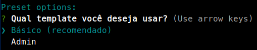

# vue-cli-preset
> 💚 🔮 Personal preset for vue-cli

## Usage

1. Install [Vue CLI](https://cli.vuejs.org/) to access `vue` command:

```bash
yarn global add @vue/cli
```

2. Initialize your Vue project with this command:

```bash
vue create --preset santospatrick/vue-cli-preset my-project
```

3. Choose your template



4. Done :tada:

## Template "admin" 

Run your mock server with the following command:

```bash
yarn mock
```

## Features

- [x] App structure (base/admin)
- [ ] README.md | CONTRIBUTING.md
- [ ] Pasta pages -> modules
- [ ] Mover forms/ pra modules/x/forms
- [ ] Pasta services -> network
- [ ] Services em cada módulo
- [ ] Vuepress
- [x] CRUD example
    - [x] Mock
    - [x] Form
    - [x] Routes
    - [x] Vuex

## Development

```
git checkout develop
vue create --preset ./vue-cli-preset my-project
```

## Read more

- [Custom Remote Presets](https://cli.vuejs.org/guide/plugins-and-presets.html#remote-presets)
